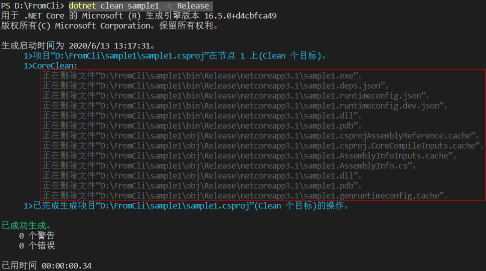

[TOC]

### 1. 准备开发环境

#### 1.1. 安装`Visual Studio Code`

​	官网地址：https://code.visualstudio.com/

#### 1.2. 安装`.net core`

官网地址: https://dotnet.microsoft.com/download/dotnet-core/3.1


查看是否安装成功:  cmd模式下输入`dotnet --version`显示版本


#### 1.2. 安装插件

- C#: C#关键字高亮突出和语法检查
- C# Namespace Autocompletion: 自动完成命名空间
- C# XML Documentation Comments: 文档注释
- Auto-Using for C#: 自动导入命名空间
- NuGet Package Manager: 包下载管理器
- vscode-solution-explorer: Solution管理，类似VS2010可以创建项目，编译项目，发布项目等

#### 1.3. `Visual Studio Code`配置

​	打开setting.json文件，配置如下：

```json
{
  "editor.formatOnType": true,
  "files.autoSave": "afterDelay",
  "editor.formatOnSave": true,  //Ctrl+S自动格式化
  "[csharp]": {
    "editor.defaultFormatter": "ms-dotnettools.csharp" //设置格式化方式
  }
}
```

### 2. 基本命令

```markdown
sdk-options:
  -d|--diagnostics  启用诊断输出。
  -h|--help         显示命令行帮助。
  --info            显示 .NET Core 信息。
  --list-runtimes   显示安装的运行时。
  --list-sdks       显示安装的 SDK。
  --version         显示使用中的 .NET Core SDK 版本。

SDK 命令:
  add               将包或引用添加到 .NET 项目。
  build             生成 .NET 项目。
  build-server      与由生成版本启动的服务器进行交互。
  clean             清理 .NET 项目的生成输出。
  help              显示命令行帮助。
  list              列出 .NET 项目的项目引用。
  msbuild           运行 Microsoft 生成引擎(MSBuild)命令。
  new               创建新的 .NET 项目或文件。
  nuget             提供其他 NuGet 命令。
  pack              创建 NuGet 包。
  publish           发布 .NET 项目进行部署。
  remove            从 .NET 项目中删除包或引用。
  restore           还原 .NET 项目中指定的依赖项。
  run               生成并运行 .NET 项目输出。
  sln               修改 Visual Studio 解决方案文件。
  store             在运行时包存储中存储指定的程序集。
  test              使用 .NET 项目中指定的测试运行程序运行单元测试。
  tool              安装或管理扩展 .NET 体验的工具。
  vstest            运行 Microsoft 测试引擎(VSTest)命令。
捆绑工具中的其他命令:
  dev-certs         创建和管理开发证书。
  fsi               启动 F# 交互/执行 F# 脚本。
  sql-cache         SQL Server 缓存命令行工具。
  user-secrets      管理开发用户密码。
  watch             启动文件观察程序，它会在文件发生更改时运行命令。
```

### 3. 基本命令的使用(本例使用`控制台`程序作为范例)
#### 3.1. 创建`sample1`应用程序

```markdown
template: dotnet new console --output <PROJECT_NAME>|dotnet new console -o <PROJECT_NAME>|
dotnet new console --name <PROJECT_NAME>|dotnet new console -name <PROJECT_NAME>
```

```markdown
ex: dotnet new console -o sample1
```


~~~markdown
ex: dotnet new console  --默认使用当前文件夹名作为应用程序名(不推荐使用)
~~~


#### 3.2. 运行`sample1`应用程序

```markdown
Template: dotnet run -p <PROJECT_NAME>|Template: dotnet run --project <PROJECT_NAME>
```

```markdown
ex: dotnet run --project sample1
```


#### 3.3. 编译`sample1`应用程序（Debug模式）

```markdown
Template: dotnet build <PROJECT_NAME>
```

```markdown
ex: dotnet build sample1
```


#### 3.4. 清除编译的`sample1`应用程序（Debug模式）

```markdown
Template: dotnet clean <PROJECT_NAME>
```

```markdown
ex: dotnet clean sample1
```


#### 3.5. 编译`sample1`应用程序（Release模式）

```markdown
Template: dotnet build <PROJECT_NAME> -c Release|dotnet build <PROJECT_NAME> --configuration Release
```

```markdown
ex: dotnet build sample1 -c Release
```


#### 3.6. 清除编译的`sample1`应用程序（Release模式）

```markdown
Template: dotnet clean <PROJECT_NAME> -c Release|dotnet clean <PROJECT_NAME> --configuration Release
```

```markdown
ex: dotnet clean sample1 -c Release
```




#### 3.7. 发布`sample1`应用程序（Release模式）

```markdown
Template: dotnet publish <PROJECT_NAME> -c Release|dotnet publish <PROJECT_NAME> --configuration Release
```

```markdown
ex: dotnet publish sample1 -c Release
```


#### 3.8. 为`sample1`创建解决方案`SampleSln`

```markdown
Template: dotnet new sln --name <SOLUTION_NAME>|dotnet new sln -n <SOLUTION_NAME>|
dotnet new sln --output <SOLUTION_NAME>|dotnet new sln -o <SOLUTION_NAME>
Ps: --name|-n[1]和--output|-o[2]的区别是[1]只创建solution文件，[2]创建文件夹并将solution文件添加到新创建的文件夹，且文件夹名和solution文件名一致
```

```markdown
ex: dotnet new sln --name SampleSln
```


#### 3.9. 将`sample1`添加到解决方案`SampleSln`

```markdown
Template: dotnet sln <SOLUTION_NAME>.sln add <PROJECT_NAME>/<PROJECT_NAME>.csproj
```

```markdown
ex: dotnet sln SampleSln.sln add sample1/sample1.csproj
```


#### 3.10. 将`sample1`从解决方案`SampleSln`中移除

```markdown
Template: dotnet sln <SOLUTION_NAME>.sln remove <PROJECT_NAME>/<PROJECT_NAME>.csproj
```

```markdown
ex: dotnet sln SampleSln.sln remove sample1/sample1.csproj
```


#### 3.11. 将`sample1`代码打包在NuGet 包

```markdown
Template: dotnet pack <PROJECT_NAME>/<PROJECT_NAME>.csproj  
Ps: 打包在Debug目录下
```

```mark
ex: dotnet pack ProjectName/ProjectName.csproj  
```


```markdown
Template: dotnet pack <PROJECT_NAME>/<PROJECT_NAME>.csproj -o <FOLDER_NAME>|
dotnet pack <PROJECT_NAME>/<PROJECT_NAME>.csproj --output <FOLDER_NAME> 
```

```markdown
ex: dotnet pack sample1/sample1.csproj --output nupkgs 注：打包在指定文件 
```


#### 3.12. `sample1`添加包

```markdown
Template: dotnet add <PROJECT_NAME> package <PACKAGE_NAME>
```

```markdown
ex: dotnet add sample1 package Newtonsoft.Json
```


```markdown
Template: dotnet add <PROJECT_NAME> package <PACKAGE_NAME> -v <VERSION>
```

```markdown
ex: dotnet add sample1 package Newtonsoft.Json -v 12.0.1
```


```markdown
Template: dotnet remove <PROJECT_NAME> package <PACKAGE_NAME> 
```

```markdown
ex: dotnet remove sample1 package Newtonsoft.Json
```


